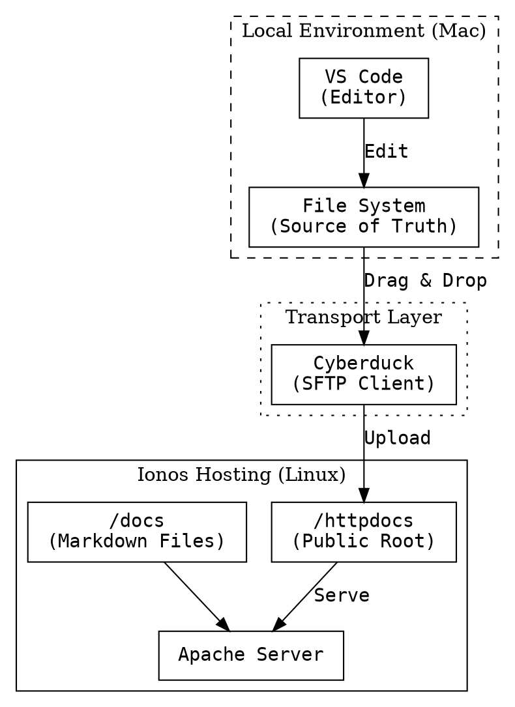

# System Architecture

**Project:** PolyVis | **Version:** 1.0

This platform adheres to the **Principle of Effective Low-Tech Defence**. It avoids complex build chains in favor of raw, editable standards (HTML/CSS/JS).

## Deployment Pipeline

We use a manual "Push" architecture via SFTP, ensuring total control over the artifacts.

## Source Code

[GitHub Repository](https://github.com/pjsvis/polyvis)
