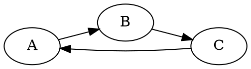
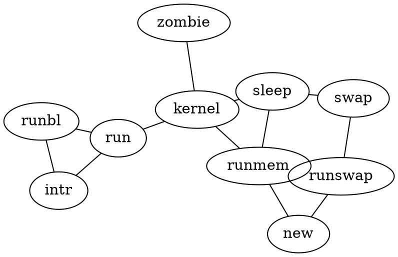

# DOT Rendering Test

This document tests the inline rendering of Graphviz DOT diagrams.

## Simple Digraph

```dot
digraph G {
  rankdir=LR;
  A -> B -> C;
  C -> A;
}
```

## Complex Graph

```dot
graph G {
  layout=neato;
  run -- intr;
  intr -- runbl;
  runbl -- run;
  run -- kernel;
  kernel -- zombie;
  kernel -- sleep;
  kernel -- runmem;
  sleep -- swap;
  swap -- runswap;
  runswap -- new;
  runswap -- runmem;
  new -- runmem;
  sleep -- runmem;
}
```
