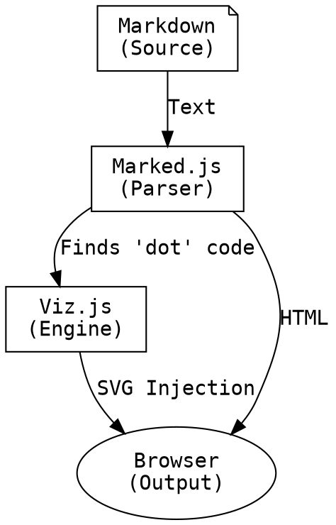

# Project Alpha

Welcome to the **PolyVis** documentation system. This content is rendered directly from a Markdown file.

## The Concept

We transform "Stuff" into "Things". This process is recursive and structural.

## Structural Map

Here is the operational logic, rendered live from DOT code:

