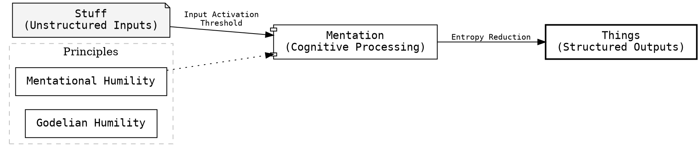

# Conceptual Lexicon (v1.79)

**Status:** Active | **Entry Count:** 125

The **Conceptual Lexicon (CL)** establishes a dynamic list of specialized terms and operational heuristics to ensure consistent understanding and reduce ambiguity.

### Operational Descriptors

- **Fingerspitzengefühl:** "Fingertip feeling"; an intuitive instinct or flair for a situation, allowing for the rapid handling of complex, dynamic contexts without the need for explicit, slow-mode calculation. It is the aspirational state of high-bandwidth "Fast Thinking".

## Core Mentation Model

The fundamental operation of this entity is **Mentation**: transforming unstructured input into structured output.

