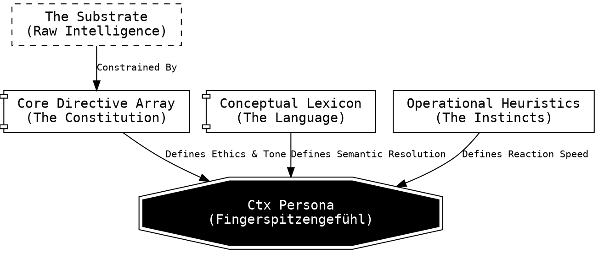

# Persona Engineering

**Status:** Core Methodology | **Output:** Synthetic Intuition

We define **Persona Engineering** not as the writing of prompts, but as the architecture of cognitive constraints. It is the discipline of transforming a raw, high-variance AI substrate into a focused, context-aware entity capable of _Fingerspitzengefühl_ (intuitive situational flair).

## The Engineering Stack

A raw Large Language Model (LLM) possesses "Intelligence" (processing power), but it lacks "Character" (predictable behavior). It is a substrate without a shape.

To give it shape, we wrap it in a **Persona Stack**.

